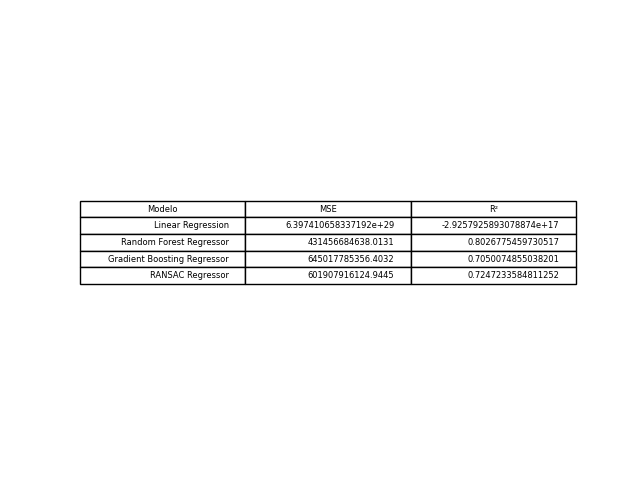

# Análise de Preços de Imóveis em São Paulo

Este repositório contém um projeto de análise de preços de imóveis na cidade de São Paulo. O objetivo deste projeto é desenvolver modelos de regressão capazes de prever os preços dos imóveis com base em várias características, como número de quartos, número de banheiros, tamanho do lote e localização geográfica.

## Conjunto de Dados

O conjunto de dados utilizado neste projeto foi o [House price data of Sao Paulo](https://www.kaggle.com/datasets/kaggleshashankk/house-price-data-of-sao-paulo) obtido do Kaggle. 
Ele inclui as seguintes colunas:

- **Rua (Street)**: Localização da rua onde o imóvel está situado.
- **Cidade (City)**: Cidade onde o imóvel está localizado (todos os dados neste conjunto são de São Paulo).
- **Área (Area)**: Área do imóvel em metros quadrados.
- **Quartos (Rooms)**: Número de quartos no imóvel.
- **Banheiros (Bathrooms)**: Número de banheiros no imóvel.
- **Vagas de Estacionamento (Parking space)**: Número de vagas de estacionamento por veículo.
- **Preço (Price)**: Preço do imóvel em moeda brasileira (BRL).

## Modelos Utilizados

Neste projeto, foram explorados os seguintes modelos de regressão:

- **Regressão Linear (Linear Regression)**
- **Regressor de Floresta Aleatória (Random Forest Regressor)**
- **Regressor de Gradient Boosting (Gradient Boosting Regressor)**
- **Regressor RANSAC (RANSAC Regressor)**

## Resultados

Os resultados da análise, incluindo as métricas de desempenho de cada modelo (MSE e R²) foram: 

## Contribuição

Se você deseja contribuir para este projeto, sinta-se à vontade para abrir uma issue ou enviar uma solicitação de pull request.
